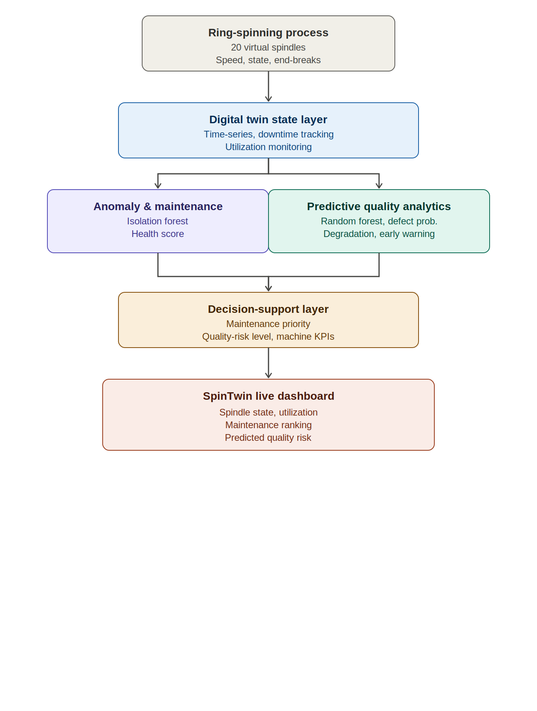
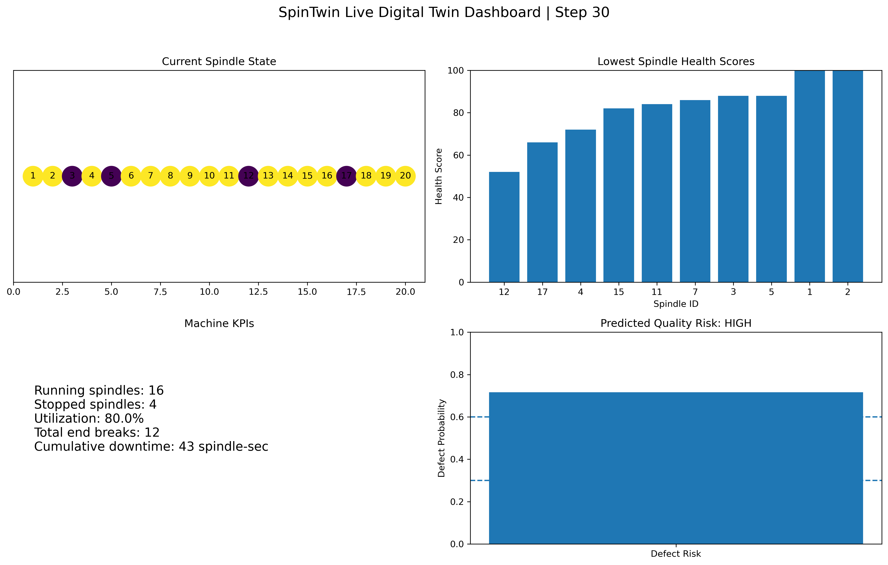

# SpinTwin

## A Simulation-Based Digital Twin for Ring-Spinning Monitoring, Predictive Quality, and Maintenance Decision Support

SpinTwin is a simulation-based digital-twin prototype for ring-spinning manufacturing. The project integrates spindle-level state monitoring, downtime and end-break tracking, machine-utilization analysis, anomaly detection, predictive quality modeling, maintenance prioritization, and a live monitoring dashboard.

The current implementation is designed as a research and demonstration prototype using synthetic process and quality data.

---

## Motivation

Ring-spinning operations generate continuous machine-state information that can support quality monitoring, process optimization, and maintenance decisions.

This project was motivated by industrial exposure to real-time spindle-level monitoring in textile manufacturing and explores how similar operational data can be integrated with machine learning and digital-twin concepts.

The objective is not to reproduce a commercial industrial system, but to demonstrate an end-to-end workflow for:

- machine-state representation,
- real-time monitoring,
- anomaly detection,
- quality-risk prediction,
- maintenance prioritization, and
- manufacturing decision support.

---

## System Architecture



The SpinTwin workflow consists of five main layers:

1. **Ring-Spinning Process Simulation**
   - Virtual spindle operation
   - Running/stopped states
   - Spindle speed
   - End-break events

2. **Digital Twin State Layer**
   - Stateful monitoring
   - Time-series data
   - Downtime tracking
   - Machine utilization

3. **Analytics Layer**
   - Isolation Forest anomaly detection
   - Random Forest quality prediction
   - Process-degradation analysis
   - Persistent early-warning logic

4. **Decision-Support Layer**
   - Spindle health assessment
   - Maintenance prioritization
   - Quality-risk categorization
   - Machine KPI monitoring

5. **Visualization Layer**
   - Live spindle state
   - Machine utilization
   - Maintenance ranking
   - Predicted quality risk

---

## Live Digital Twin Dashboard



The live dashboard combines:

- current spindle operating states,
- running and stopped spindle counts,
- machine utilization,
- cumulative end breaks,
- cumulative downtime,
- spindle health ranking, and
- predicted yarn-quality risk.

---

## Key Features

### Stateful Spindle Simulation

Each virtual spindle maintains an operating state over time. When a simulated end break occurs, the spindle remains stopped for a recovery period before returning to operation.

### End-Break Detection

A new end break is detected from a transition:

```text
Running → Stopped